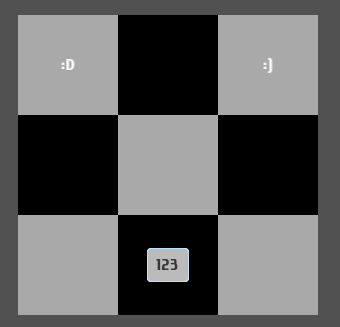

# Checkerboard

This is a checkerboard container (grid of boxes with alternating background colors). Provided widgets are distributed from left to right, top to bottom. If the are more provided widgets than there are boxes in the grid then last widgets are ignored.

## Usage

- `checkerboard cols rows listOfWidgets`
- `checkerboard_ cols rows configs listOfWidgets`

Here is the [example](/examples/checkerboard/UI.hs).

## Configuration

- `[lightColor color]`. Set color of light squares in the checkerboard pattern.
- `[darkColor color]`. Set color of dark squares in the checkerboard pattern.
