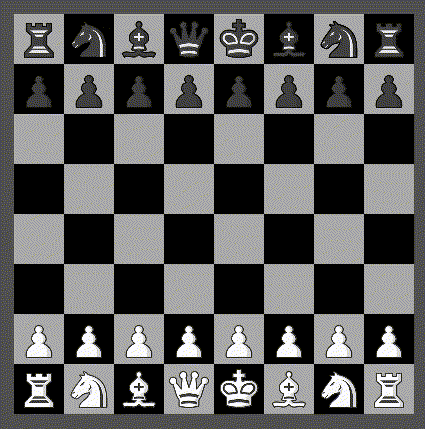

# Dragboard

This is a dragboard which uses checkerboard with draggable images or
colored fillers. It needs to be provided with number of rows and
columns, lens to the board state of type `[[a]]` (each square of the
board would thus contain a list of items `[a]` and show only the
first item) and the function which converts item `a` to either color
of a filler or path to the image.

## Usage

- `dragboard cols rows field f`
- `dragboard_ cols rows field f configs`

Here is the [example](/examples/dragboard/UI.hs).

## Configuration

- `[moveValidator f]`, where `f` is a function of type `([[a]], Int, Int) -> Bool`. It receives previous board, index of a square where item has been
dragged to and index of a square where item has been dragged from
and returns whether this move is valid or not. If move is not valid
then the board state will not change.
- `[dragIdOffset i]`. When there are multiple dragboards, it possible to drag an item from one dragboard to another. In order to ignore drop events caused by foreign items or to process them properly, the dragboards should use different offsets (for example, if each dragboard has less than 1000 squares, then multiples of 1000 can be used as offsets).
- `[checkerConfig configs]`. Config options for checkerboard container which is used by dragboard.
- `[onChange f]`, where type of `f` is `([[a]], Int, Int) -> e`: `[[a]]` is the board state before change, the first `Int` is destination square, the second `Int` is source square and `e` is the event.
- `[onFocus f]`, where type of `f` is `Path -> e`: event to raise when the composite receives focus.
- `[onBlur f]`, where type of `f` is `Path -> e`: event to raise when the composite loses focus.
