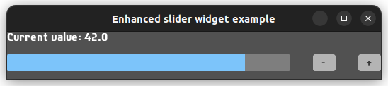

# Enhanced slider

This is a slider with a label, which shows current value, and buttons to increase and decrease value.

## Usage

- `enhancedSlider field min max`
- `enhancedSlider_ field min max configs`

## Configuration

- `enhancedSlider_ field min max [titleCaption title]`. By default the label only shows current value. `titleCaption` can be used to provide title for the value.
- `enhancedSlider_ field min max [titleMethod f]`, where type of `f` is `a -> Text`. Should be used if the title depends on the value
or different formatting is needed.
- `enhancedSlider_ field min max [hideLabel]`. Should be used when the label with the current value is not needed.
- `... [alignLeft]`. Put slider to the left of the buttons. Default behavior.
- `... [alignCenter]`. Put slider between the buttons.
- `... [alignRight]`. Put slider to the right of the buttons.
