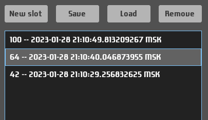

# Save manager

This is a composite which consists of `selectList` and buttons:
- New slot
- Save
- Load
- Remove

## Usage

- `saveManager field`
- `saveManager_ field configs`

Here is the [example](/examples/save-manager/UI.hs).

## Model
The composite works with the field of type `SaveManagerModel a`.
This structure contains four fields:

- Saved data - sequence of saved objects: `Seq (a, Text)`. `SaveManager` module exports `Saves a` which is alias for `Seq (a, Text)`.
- Current data - the active value `a`.
- Selected data - `Maybe Int` position of the selected slot. When there are no slots, it is `Nothing`.
- Whether confirmation dialog is currently shown. Used internally.

It should be initialized with `initSaveManagerModel a` if there is no need to initialize slots (e.g. from file). Otherwise `initSaveManagerModel_` should be used.

## New slot
When this button is clicked, new slot `(a, Text)` is created where `a` is the active value and `Text` is current time (or something else if `captionMethod` is provided). New slot button is always enabled and other buttons are enabled only if some slot is selected.

## Save
When this button is clicked, the active value is saved into the selected slot and its caption is updated.

## Load
When this button is clicked, the active value is loaded from the selected slot.

## Remove
When this button is clicked, the confirmation dialog is shown with `Remove` and `Cancel` buttons. `Cancel` will just close the dialog and `Remove` will remove the selected slot. However, if configured with `noConfirm` option, then no confirmation dialog will be shown and the selected slot will be removed immediately.

## Configuration
- `saveManager_ field [captionMethod f]`, where `f` is a function of type `a -> ZonedTime -> Text`. By default slot captions show only time of its modification. `captionMethod` can be used to show more information about the stored value.
- `saveManager_ field [onSavesChange f]`, where type of `f` is `Saves a -> e`: event to raise when saves change (all actions except loading from the slot). For example, it could be used to synchronize saves with file.
- `saveManager_ field [onChange f]`, where type of `f` is `a -> e`: `a` is loaded value and `e` is the event.
- `saveManager_ field [onFocus f]`, where type of `f` is `Path -> e`: event to raise when the composite receives focus.
- `saveManager_ field [onBlur f]`, where type of `f` is `Path -> e`: event to raise when the composite loses focus.
- `saveManager_ field [noConfirm]`. Should be used when the confirmation dialog is not needed.
